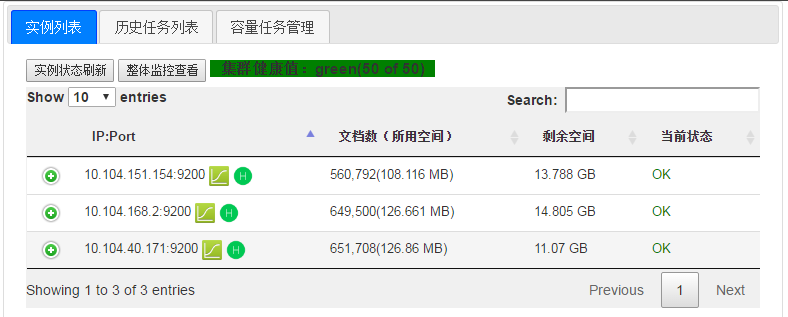
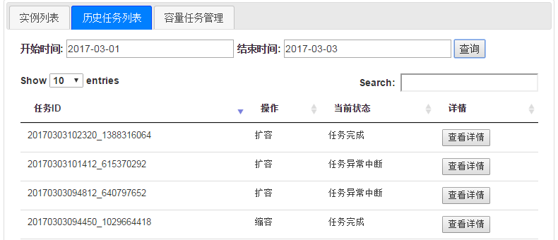
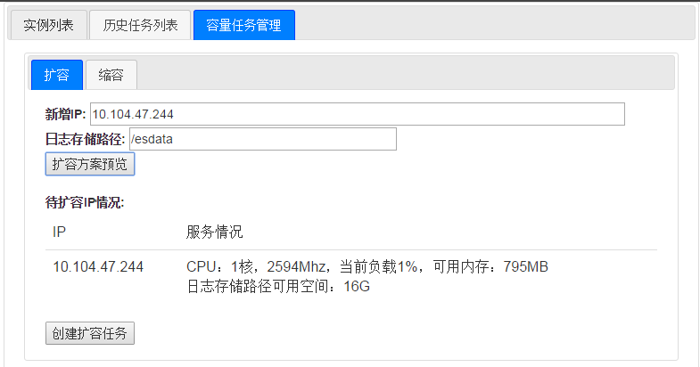
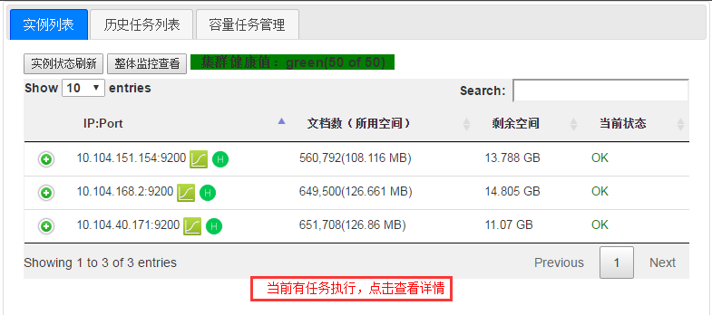
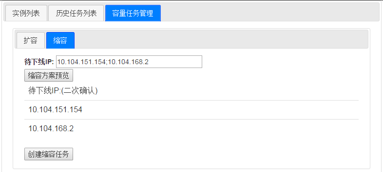
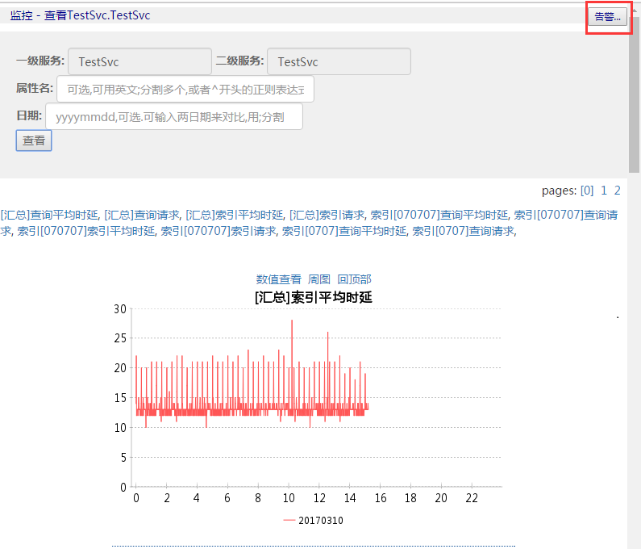
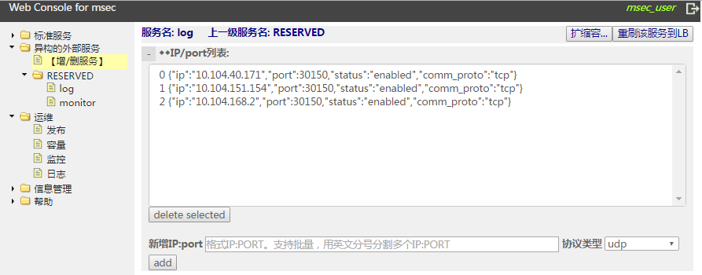
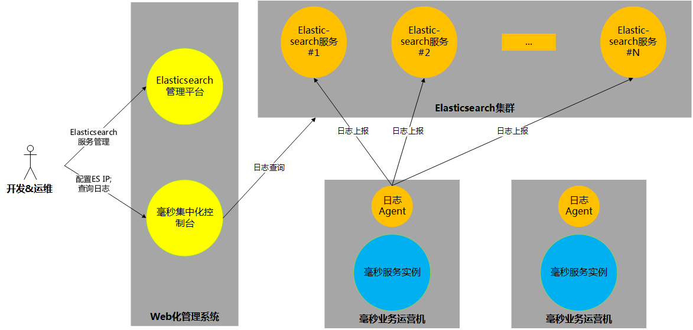

# Elasticsearch console安装和使用说明文档

*注意：Elasticsearch console只支持chrome浏览器，其他浏览器都没有测试。*

# 一、安装

## 1.1 docker安装

由于监控系统等都是以docker镜像提供便捷的安装方式，部署时需先安装docker.

这里以centos为例进行说明，执行命令：

```bash
yum install docker
```

一般情况会直接成功，显示Complete!

但是腾讯云的centos7版本下会报错，需要更新一下lvm2，所以先执行：

```bash
yum install lvm2
```

安装好之后，启动docker：

```bash
service docker start
```

初次启动需要一段时间，要耐心等。以上命令执行完之后，可以检查docker是否运行成功：

```bash
docker ps -a
#result looks like:
#CONTAINER ID IMAGE COMMAND CREATED STATUS PORTS NAMES
```

如果运行出现以上结果，说明docker已经运行成功了！

特别注意：docker要求1.8或者更高的版本

## 1.2 Elasticsearch console系统安装

1. 加载docker镜像

	```bash
	docker import es_console.tar.gz centos:esconsole
	docker images
	#result looks like:
	#REPOSITORY TAG IMAGE ID CREATED VIRTUAL SIZE
	#centos es_console 124711e5ca6e 59 seconds ago 1.026 GB
	```

2. 解压数据卷, 并移至目录： /es_console_data

	```bash
	tar xvf es_console_data.tar.gz; mv es_console_data es_console_data
	```

3.  运行docker镜像

	```bash
	docker run --net=host --ipc=host -d -it -v /es_console_data/:/msec --privileged=true -v /etc/localtime:/etc/localtime:ro centos:es_console '/etc/rc.d/rc.local'
	```

4.  查看服务正常

	```bash
	netstat -anop |grep '8080\|38002\|9982' |grep LISTEN
	#result looks like:
	#tcp 0 0 0.0.0.0:9982 0.0.0.0:* LISTEN 2326/java off (0.00/0/0)
	#tcp 0 0 0.0.0.0:8080 0.0.0.0:* LISTEN 2359/java off (0.00/0/0)
	#tcp 0 0 0.0.0.0:38002 0.0.0.0:* LISTEN 2815/./monitor_serv off (0.00/0/0)
	```

5.  进入监控系统管理页面查看是否正常, URL为 http://Console_IP:8080

## 1.3 Elasticsearch实例业务机依赖项

根据[Elasticsearch官网手册](https://www.elastic.co/guide/en/elasticsearch/reference/current/setup.html)说明，Elasticsearch实例业务机需要至少[Java 8](http://www.oracle.com/technetwork/java/javase/downloads/index.html)及以上版本，推荐使用JDK 1.8.0_121及以上版本,可以通过以下命令来检查你的Java版本（如果有需要，安装或者升级）：

```
java -version
echo $JAVA_HOME
```

## 1.4 服务端口列表

Elasticsearch管理平台需要开放下述端口：

| 服务端口 | 开放目的 |
| --- | --- |
| 8080 | 服务管理页面 |
| 8081 | Nignx服务，用于Head插件展示及作为Elasticsearch Http API的反向代理 |
| 9982 | 远程命令数据传输服务端口 |
| 38002 | 监控服务业务上报端口 |
| 38003 | 监控服务数据获取端口 |

Elasticsearch实例业务机需要开放下述端口：

| 服务端口 | 开放目的 |
| --- | --- |
| 9200 | Elasticsearch Http API服务端口 |
| 9300 | Elasticsearch Java API服务端口 |
| 30150 | 日志查询端口 |
| 44445 | 日志入库端口 |

# 二、使用说明

## 2.1登录与账号管理

系统预置了一个账号：
> 预置登录用户名为： msec_user 密码为: msec_pass 

用该账号登录后，需要立即改密，并增加需要的其他账号。


## 2.2服务配置管理

服务名字空间是树状的方式维护，有且只有两级。Elasticsearch服务的配置及状态展现，包括：

1.  IP/Port列表：配置该服务部署到哪些机器上面，通过扩容、缩容流程进行集群的容量管理；同时可以实时展现当前集群的健康度以及各实例的服务状态。
	
2.  扩容管理：集群增加一个/多个ip。

3.  缩容管理：集群去除一个/多个ip。



每个实例的IP:Port后有两个图标，点击分别展示IP的基础属性以及Elasticsearch的Head插件。

点击加号可以对当前实例进行服务重启，适用于服务宕机后的恢复。

## 2.3 历史任务列表

历史任务列表列举了指定时间段内的流程操作及完成状态，可以点击详情查看具体操作的执行情况。



## 2.4 初始化/扩容流程

待初始化/扩容机器首先需要安装Remote shell agent。如果没有对秘钥进行变动的话，可在页面左侧“客户端Agent下载”栏目中下载agent并安装到待扩容机器上。

输入待扩容机器IP后，页面会进行二次确认。特别的，如果待扩容机器的Remote Shell Agent没有正确安装，也会进行提示。



确认ok点击“创建扩容任务”页面会生成扩容任务。扩容流程中Elasticsearch实例会自动和集群中现有的机器进行互相发现，并完成集群加入。用户可以在历史任务列表或点击列表下面的任务进度栏查看任务进展。*注意：同一时刻只允许一个任务执行。*



完成分配后， 实例列表页面会自动刷新。

*注意：为了保证Elasticsearch集群的自动容错，一个集群至少需要三台或以上机器。*

## 2.5 缩容流程

缩容流程可以移除一个/多个Elasticsearch实例。



页面会开始操作进行实例下线，并更新实例列表。

## 2.6 监控页面

用户可以点击实例列表的“整体监控查看”查看服务的总体监控视图，或者点击单个实例的查看实例IP的基础属性视图。



点击右上角的“告警”可以查看当前服务的监控告警情况，用户可以按属性及告警类型设置告警。告警类型分为“超过最大值”、“低于最小值”、“波动绝对值过大”、“波动百分比过大”四类，其中波动告警是和前一天数据进行比较。

# 三、后台程序和数据

## 3.1关键程序

有三个后台关键程序，在docker镜像执行的时候，通过运行`/etc/rc.d/rc.local`脚本启动了这三个程序。

### 3.1.1 mysql

我们使用mysql保存Elasticsearch站点的数据

路径：/usr/local/mysql

主要程序/文件: bin/mysqld_safe bin/mysql

端口号：3306

### 3.1.2 remote_shell

我们使用remote_shell对业务运营机进行管理，可以传输文件、执行命令

路径：/usr/local/remote_shell

主要程序/文件：server.jar priv.txt

端口号：9982

特别说明：部署在业务运营机上的remote_shell_agent通过公钥密码算法实现对remote_shell server进行身份认证，priv.txt文件就是remote_shell server的身份文件，安装remote_shell_agent后需要立即进行更换并保密，具体做法见本文档的`4.2 remote shell身份认证`

### 3.1.3 tomcat

我们的console站点使用tomcat作为Elasticsearch console服务器

路径：/usr/local/tomcat-8

主要程序/文件：位于webapp/ROOT下

端口：8080

## 3.2 关键数据

/msec/console_log是站点的log所在目录 log.log和err.log是当前的log

/msec/mysqldata mysql里数据的存储目录

/msec/tomcat_log tomcat的log目录

# 四、用于毫秒服务引擎的集群版日志系统

## 4.1 配置

Elasticsearch服务可以用作毫秒服务引擎的日志系统。用户无需修改已有毫秒服务的代码或现网毫秒实例，仅需下述操作即可无缝接入Elasticsearch服务，具体操作步骤如下：

1. 在每个毫秒服务实例的业务机上更新日志agent，agent会将数据发向集群版的日志系统，并重启日志agent服务：

	```
	/msec/agent/logsys/bin/restart.sh
	```
	
	*注意：仅需要重启日志agent即可，无需重启毫秒实例*

2. 在毫秒web化控制台上更新Elasticsearch系统的IP，对应上面的Elasticsearch集群，更新服务IP列表信息如下，注意端口默认为30150，使用tcp协议：



完成上述步骤后，日志的录入和查询即可切换到Elasticsearch系统。

## 4.2 架构简图

使用了Elasticsearch系统作为毫秒引擎的集群版日志系统后，整个架构简图如下：




# 五、业务机Agent安装

## 5.1 agent包下载和安装

业务机需要部署Agent才能完成和Console之间的交互以及监控数据的上报。请在页面“客户端Agent下载-下载”中获取Agent包，并放置于Elasticsearch实例业务机的/msec/agent/目录里。

将下载包解压，使用`/msec/agent/start.sh ip`启动agent，其中ip参数为Elasticsearch console的内网IP。

## 5.2 remote shell身份认证【重要！】

部署在业务运营机上的remote_shell_agent接受Elasticsearch console服务器上的remote\_shell\_server.jar程序的管理，可以传输文件、远程执行命令。

这里的安全性考虑和加强请务必阅读 [msec console使用说明文档的第3部分](https://github.com/Tencent/MSEC/blob/master/document/msec/msec_console_guide.md#3remote-shell身份认证)


# 六、日志调用API

## 6.1 日志系统接口(C++)
初始化

```c++
    /*
    * 根据配置文件初始化API
    * 返回值： 0表示初始化成功， 其他表示初始化失败
    */
    int LogsysApi::Init(const char* conf_filename); 
```

设置日志字段

```c++
    /*
    * 设置日志字段
    * 输入参数： key     字段名
    *            value   字段值
    */
    LogsysApi& msec::LogSetHeader(const std::string& key, const std::string& value); 
```

记录远程日志

```c++
    /*
    * 记录远程日志
    * 输入参数： level   日志级别
    *            format  日志内容
    */
    void msec::LOG(int level, const char* format, ...);
```

示例代码：

```c++
    msec::LogsysApi* log_api = msec::LogsysApi::GetInstance();
    int ret = log_api->Init("./config.ini");
    if (ret != 0)
    {
        cerr << "logsys api init failed." << endl;
        return -1;
    }
        
    msec::LogSetHeader("ReqID", "1234888").LogSetHeader("IP", "26.19.3.333").LogSetHeader("ServiceName", "TestSvc.TestSvc");
    msec::LOG(msec::LogsysApi::ERROR, "%s", "something");
```

## 6.2 日志系统接口(Java)
初始化

```java
    /*
    * 根据配置文件初始化API
    * 返回值： true表示初始化成功， 其他表示初始化失败
    */
    boolean AccessLog:: initLog(const char* conf_filename); 
```

记录远程日志

```java
    /*
    * 记录远程日志
    * 输入参数： level   日志级别
    *            headers  日志的自定义字段
    *            body     日志内容
    */
    void  AccessLog::log(int level, Map<String, String> headers, String body);
```

## 6.3 日志系统配置文件说明

```
[LOG]
Level=DEBUG
[COLOR]
FieldName0=uin
FieldValue0=11228499
FieldName1=merchID
FieldValue1=M1234
```

LOG/Level表示日志级别，可选级别有:  TRACE, DEBUG, INFO, ERROR, FATAL
COLOR下为染色配置，满足染色条件的日志会忽略日志级别，全部记录下来。
染色条件为自定义Name、自定义Value的形式，即两者同时匹配就会满足染色条件。
如上配置会将uin字段为11228499的日志染色，也会将merchID字段为M1234的日志染色。
